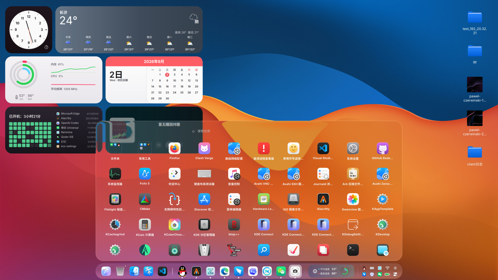
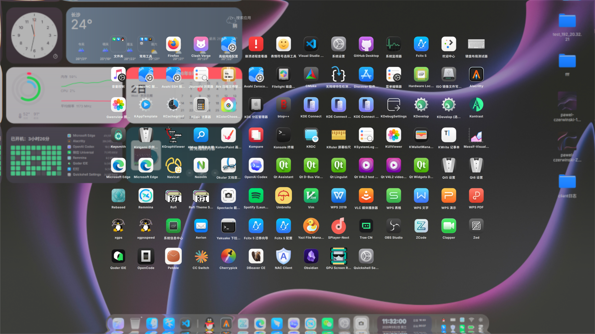
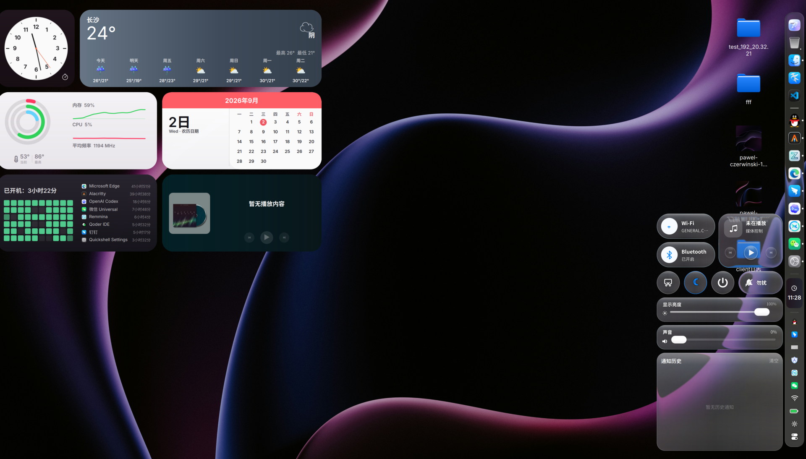
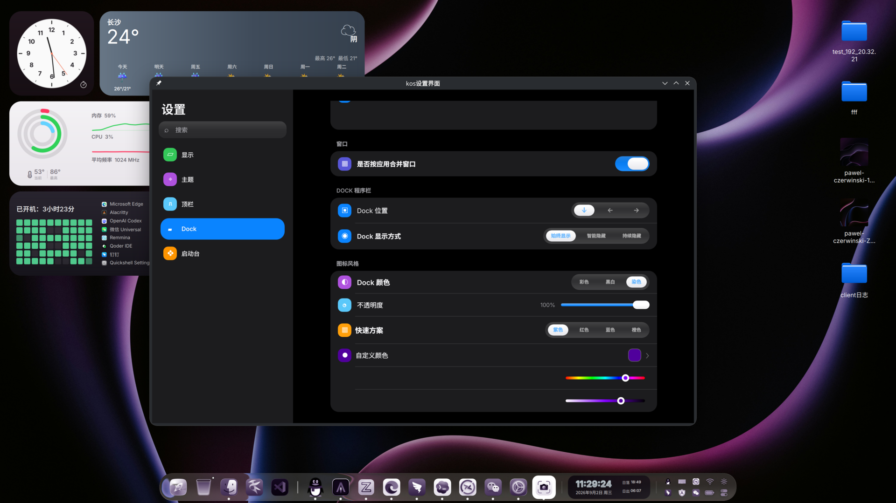

# KOS Desktop Shell

[中文](README.md)

KOS is a Quickshell desktop shell for KDE Plasma 6 on Wayland. It adds a top
bar, dock, launcher, search, notifications, and settings UI while keeping KDE,
KWin, NetworkManager, and other system components in place.

## Get started

### 1. Install requirements

Use a KDE Plasma 6 **Wayland** session. You need Git, CMake, Ninja, a C++
compiler, Qt 6, Go, and Quickshell 0.3.x.

On Arch:

```sh
sudo pacman -S git quickshell cmake ninja gcc qt6-base go
```

Install equivalent packages on other distributions. See the
[Quickshell documentation](https://quickshell.org/docs/) for Quickshell.

### 2. Clone the repository

```sh
git clone https://github.com/SuceV587/NextKde.git
cd NextKde
```

### 3. Check and install

```sh
./tools/kosctl doctor
./tools/kosctl install
./tools/kosctl start
```

`doctor` reports missing dependencies. `install` builds and installs KOS; the
first KWin-plugin installation may ask for your sudo password. `start` applies
the new version immediately and briefly refreshes the desktop UI.

KOS starts automatically after later logins.

### 4. First setup

KOS provides notifications. Remove Plasma's **Notifications** widget from the
panel or system tray first, otherwise Plasma owns the notification service.
KOS does not change your existing panel layout automatically.

## Screenshots

Full desktop with DeskCenter, the floating dock, and system status.



Fullscreen launcher for app search and grid launch.



Control center for networking, Bluetooth, brightness, volume, and notifications.



Settings center for the dock, appearance, and display mode.



## Daily use

### Update

```sh
git pull
./tools/kosctl install
./tools/kosctl start
```

### Check service status

If a feature such as brightness or networking stops updating, run:

```sh
systemctl --user status kos-platform.service kos-data.service kos-shell.service
```

Follow service logs with:

```sh
journalctl --user -u kos-platform.service -u kos-data.service -f
```

### Uninstall

```sh
./tools/kosctl uninstall
```

This removes KOS services and installed files. Personal state such as dock pins
and appearance preferences remains available for a later reinstall.

## Main features

| Area | What it does |
| --- | --- |
| Desktop widgets | Shows a clock, weather forecast, calendar, CPU/memory/temperature, uptime, app usage, and media playback information. |
| Floating dock and top bar | Shows pinned and running apps with window previews, launch animation, auto-hide, system tray, network, battery, and temperature status. The top-bar status can be integrated into the dock. |
| Launcher and search | Provides a fullscreen app grid, application search, window search, and quick access to frequent apps. |
| Control center | Manages Wi-Fi, Bluetooth, brightness, volume, media playback, dark mode, Do Not Disturb, screenshots, lock, suspend, logout, restart, and power off. |
| Desktop files | Shows desktop files and folders with open, rename, delete, copy, cut, and Open With actions. |
| Appearance and motion | Offers liquid glass, background blur, theme colors, dock position, icon style, and display mode. KWin plugins power dock and window animation. |
| Settings and shortcuts | A standalone settings center configures appearance, the dock, bar, and launcher; global shortcuts can be installed and changed in KDE System Settings. |

KOS does not replace KDE Plasma. It reuses KWin, NetworkManager, PipeWire,
BlueZ, and systemd, then presents those system capabilities in its own UI.

## Architecture at a glance

```text
Quickshell Shell ──► kos-platform ──► KWin / network / audio / Bluetooth
                 └─► kos-data-service ──► system metrics and desktop data
```

- `shell/`: UI code.
- `platform/`: system adapters for KWin, networking, audio, and brightness.
- `services/data-service/`: system metrics, history, and desktop data.
- `integrations/kwin/`: KWin plugins; `vendor/`: third-party Glass source.

See [docs/ProjectArchitecture.md](docs/ProjectArchitecture.md) for details.

## Next steps

- Better per-screen layouts and settings for multi-monitor setups.
- Complete the DeskCenter theme integration.
- Expand settings, shortcuts, and standalone apps.
- Improve keyboard navigation, accessibility, and high-contrast support.

## Development and debugging

Preview the UI without installing it:

```sh
qs -p "$PWD/shell"
```

Apply QML-only changes to an installed copy:

```sh
./tools/kosctl sync
./tools/kosctl start
```

After changing C++, Go, or KWin plugins:

```sh
./tools/kosctl install
./tools/kosctl start
```

Useful commands:

```sh
./tools/kosctl doctor
./tools/kosctl run
./tools/kosctl dev
./tools/kosctl shortcuts install
./tools/kosctl glass-settings
```

Architecture and test documentation lives in [docs/](docs/). Before
contributing, at minimum run:

```sh
git diff --check
python3 platform/tests/test_contract.py
python3 tools/check-docs.py
```

## License

This project uses the license declared by its repository. The bundled Glass
effect is licensed at [vendor/kwin-effects-glass/LICENSE](vendor/kwin-effects-glass/LICENSE).
