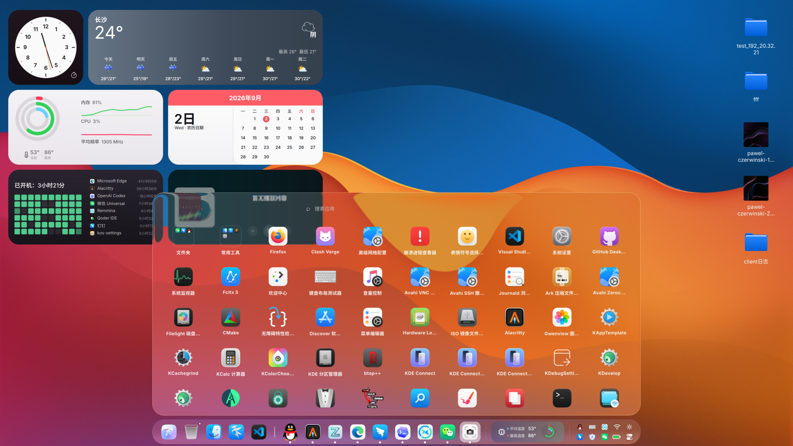
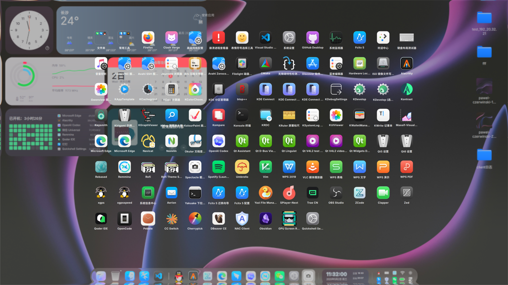
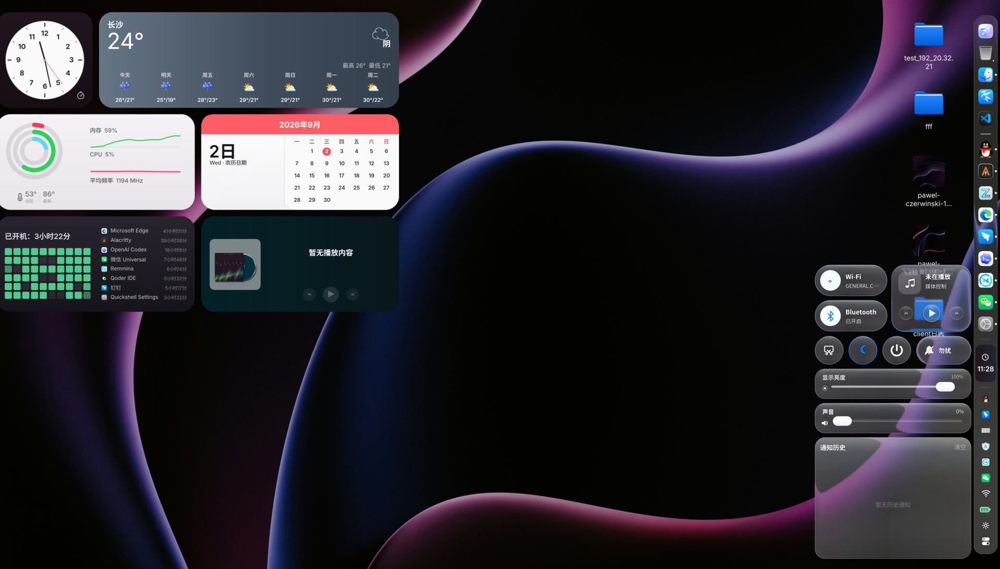
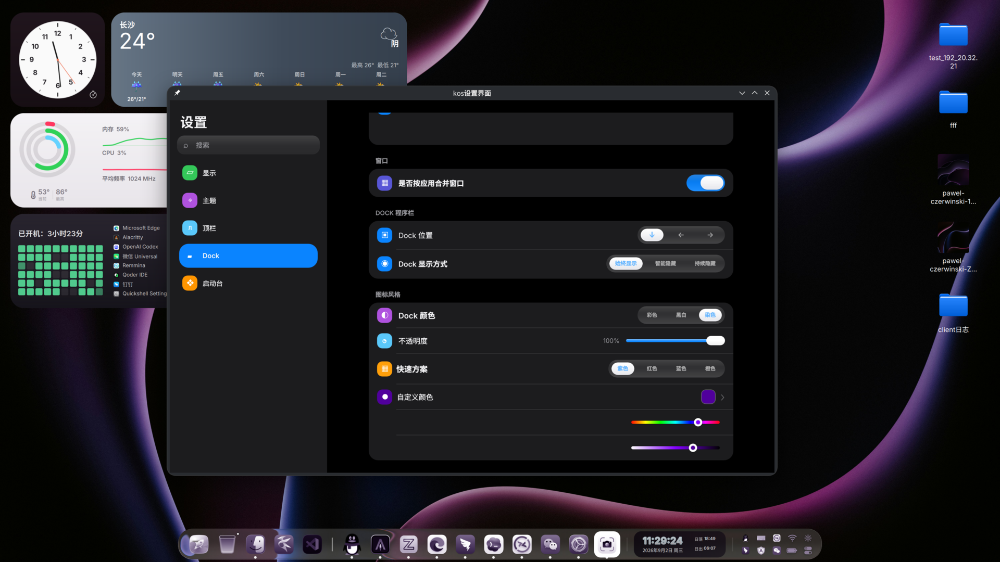

# KOS Desktop Shell

[中文](README.md)

KOS is a Quickshell desktop shell for KDE Plasma 6 on Wayland. It adds a top
bar, dock, launcher, search, notifications, and settings UI while keeping KDE,
KWin, NetworkManager, and other system components in place.

## Get started

### 1. Install requirements

Use a KDE Plasma 6 **Wayland** session (KWin 6.4 or newer), Quickshell 0.3.x,
Qt 6.6 or newer, and the complete KF6 and KWin development dependencies. The
default installation builds the platform service, Settings, KWin effects, and
the window decoration.

On Arch:

```sh
sudo pacman -S --needed \
  git quickshell cmake ninja gcc go qt6-base qt6-declarative \
  kwindowsystem kiconthemes kglobalaccel \
  extra-cmake-modules kwin kconfig ki18n kguiaddons kcmutils \
  kcoreaddons kdecoration gettext libxcb vulkan-headers
```

These runtime integration packages are recommended:

```sh
sudo pacman -S --needed \
  networkmanager wireplumber bluez-utils brightnessctl \
  wl-clipboard cliphist glib2 xdg-utils spectacle
```

The first group is required by the default build. The second group is optional
per feature and provides networking, audio, Bluetooth, brightness, clipboard
history, trash/file operations, and screenshots. Set
`KOS_BUILD_KWIN_PLUGINS=OFF` to build only the platform service and Settings
without the KWin plugin development packages.

`extra-cmake-modules` is a direct CMake dependency of the KWin plugins.
`vulkan-headers` supplies the `Vulkan::Vulkan` compile interface exported by
KWin; Arch's `kwin` package does not currently pull it in automatically, so it
must be listed explicitly. KWin also exports Wayland, libdrm, and libepoxy
development interfaces, but those are hard dependencies of Arch's `kwin`
package and do not need to be repeated here.

### Debian 13 (trixie)

`kosctl` installs missing build packages automatically on Debian too, through
`apt-get`: `./tools/kosctl doctor` reports every gap and
`./tools/kosctl install` fills it in.

Where Debian differs from Arch — and where a Debian build usually gets stuck:

- Debian's `kwin-dev` does **not** bring the libdrm and libgbm development
  files the way Arch's `kwin` package does. `libdrm-dev` and `libgbm-dev` must
  be named explicitly, or CMake stops with `Could NOT find Libdrm`.
- The xcb extension headers KWin exports (composite, randr, res, shm, sync, ...)
  are not pulled in by `kwin-dev` either.
- glib finished its time_t transition in trixie (`libglib2.0-0` became
  `libglib2.0-0t64`). `kosctl` picks whichever name the archive actually has;
  install the `t64` name by hand.
- The glass effect builds with `-DGLASS_X11=OFF` and looks for X11 with
  `QUIET`, so the X11 Xlib headers are not a build requirement.
- **Quickshell 0.3.x is not in trixie** (`quickshell` is in testing/sid only).
  Build it from source following the
  [Quickshell documentation](https://quickshell.org/docs/), temporarily enable
  a sid source, or use the Ubuntu PPA shown below. `doctor` prints a hint when
  it is missing.

Manual install, equivalent to what the script does:

```sh
sudo apt install \
  git cmake ninja-build g++ golang-go curl patchelf pkg-config \
  extra-cmake-modules libwayland-dev wayland-protocols libxkbcommon-dev \
  qt6-base-dev qt6-declarative-dev qt6-quick3d-dev qt6-svg-dev qt6-wayland-dev \
  qt6-image-formats-plugins qt6-5compat-dev libqt6svg6 \
  qml6-module-qtquick qml6-module-qtquick-controls qml6-module-qtquick-layouts \
  qml6-module-qtquick-dialogs qml6-module-qtquick-window qml6-module-qtquick-effects \
  qml6-module-qtqml-models qml6-module-qtqml-workerscript \
  qml6-module-qt5compat-graphicaleffects libopencv-dev \
  libkf6windowsystem-dev libkf6iconthemes-dev libkf6globalaccel-dev \
  libkf6kio-dev libkf6calendarcore-dev \
  kwin-dev libdrm-dev libgbm-dev libepoxy-dev \
  libkf6config-dev libkf6i18n-dev libkf6guiaddons-dev libkf6kcmutils-dev \
  libkf6coreaddons-dev libkdecorations3-dev libplasma-dev \
  gettext libvulkan-dev zlib1g-dev libxkbcommon-x11-dev \
  libxcb1-dev libxcb-composite0-dev libxcb-randr0-dev libxcb-res0-dev \
  libxcb-shm0-dev libxcb-sync-dev libxcb-xfixes0-dev libxcb-damage0-dev \
  libxcb-render0-dev libxcb-shape0-dev libxcb-cursor-dev \
  libxcb-keysyms1-dev libxcb-icccm4-dev libxcb-image0-dev libxcb-util-dev
```

### Ubuntu 26.04 (resolute)

`kosctl` installs missing build packages automatically on Arch, Debian-family
systems (Ubuntu included) and NixOS. The list below mirrors what the script
installs, for manual cross-checking; it has been verified with a full default
build on 26.04.

Quickshell 0.3.x is not in the Ubuntu archive yet; use the PPA recommended by
the [Quickshell documentation](https://quickshell.org/docs/), which provides a
`resolute` series:

```sh
sudo add-apt-repository ppa:avengemedia/danklinux
sudo apt update
sudo apt install quickshell
```

Core and KWin plugin build dependencies:

```sh
sudo apt install \
  git cmake ninja-build g++ golang-go \
  qt6-base-dev qt6-declarative-dev \
  libkf6windowsystem-dev libkf6iconthemes-dev libkf6globalaccel-dev \
  extra-cmake-modules kwin-dev libkf6config-dev libkf6i18n-dev \
  libkf6guiaddons-dev libkf6kcmutils-dev libkf6coreaddons-dev \
  libkdecorations3-dev gettext libvulkan-dev libplasma-dev \
  libkf6kio-dev libkf6calendarcore-dev \
  libxcb1-dev libxcb-composite0-dev libxcb-randr0-dev libxcb-res0-dev \
  libxcb-shm0-dev libxcb-sync-dev libxcb-xfixes0-dev libxcb-damage0-dev \
  libxcb-render0-dev libxcb-shape0-dev libxcb-cursor-dev \
  libxcb-keysyms1-dev libxcb-icccm4-dev libxcb-image0-dev \
  libxcb-util-dev libxkbcommon-x11-dev
```

Optional runtime integrations (mirroring the Arch list above):

```sh
sudo apt install \
  network-manager wireplumber bluez brightnessctl \
  wl-clipboard cliphist xdg-utils kde-spectacle \
  libglib2.0-0t64 qml6-module-qtquick-dialogs libqt6sql6-sqlite
```

Key naming differences versus Arch: `kdecoration` is `libkdecorations3-dev`,
`vulkan-headers` is `libvulkan-dev`, `spectacle` is `kde-spectacle`, and
`glib2` is `libglib2.0-0t64` (the name the time_t transition left behind;
the old `libglib2.0-0` no longer exists).
Also note: `libplasma-dev` provides `Plasma/plasma_version.h` used by the
glass effect; `libkf6kio-dev` and `libkf6calendarcore-dev` are direct CMake
dependencies of the platform service and Settings (on Arch they arrive
through the dependency chain); the xcb extension headers required by KWin's
exported headers (composite, randr, res, shm, sync) are not pulled in by
`kwin-dev` and must be installed explicitly; `qml6-module-qtquick-dialogs`
and `libqt6sql6-sqlite` are runtime dependencies of QuickDialogs2 and the
data service.

Calendar, Todo, Weather, and Music are separate optional applications and are
not built by `kosctl install`. They have additional Qt/KF6, GStreamer, TagLib,
or Go dependencies; read [apps/README.md](apps/README.md) and each app's own
documentation before running `./tools/install-apps.sh`.

Install equivalent packages on other distributions. See the
[Quickshell documentation](https://quickshell.org/docs/) for Quickshell.

### 2. Clone the repository

```sh
git clone https://github.com/SuceV587/NextKde.git
cd NextKde
```

### 3. Check and install

```sh
./tools/kosctl doctor
./tools/kosctl install
./tools/kosctl start
```

`doctor` checks commands, Arch packages, and optional runtime integrations. On
Arch, `install` offers to install missing required build packages before it
builds KOS; the
first KWin-plugin installation may ask for your sudo password. `start` applies
the new version immediately and briefly refreshes the desktop UI. `install`
installs the KOS decoration together with the KWin plugins and selects KOS on
first installation, saving the previous decoration. In KOS Settings ▸ Window
and animations, turn off KOS window appearance to restore it. Decoration changes
apply at the next login; corner and shadow changes apply immediately. Reinstalling
preserves saved choices. This page includes six corner-radius stops, a shadow
switch, and minimize/restore and close animation choices. Select None to leave
that animation to other enabled KWin effects.
The NixOS module includes the decoration; `kosctl install` applies first-install defaults.

KOS starts automatically after later logins.

### Desktop file takeover (default)

`install` points `plasmashellrc`'s `[Shell] ShellPackage` at the `org.kos.desktop`
shell package that ships with KOS (`~/.local/share/plasma/shells/`): plasmashell
then only draws the wallpaper — the package's `contents/defaults` pins the
desktop containment to the wallpaper-only `org.kde.desktopcontainment`, so
`~/Desktop` is no longer rendered a second time by a folder view, and the Plasma
panel retires as well. Desktop files and interaction belong to DeskCenter
instead of two stacked copies of which one does not respond (issue #90).
**This takes effect at your next login.**

Switching shells makes plasmashell build its own appletsrc (the wallpaper
resets), so `install` migrates the desktop containments from the old appletsrc;
the previous `ShellPackage` value is saved in
`~/.local/share/kos/plasma-shell-state` and written back by `uninstall`.

### Lock screen (optional)

KOS's lock screen is optional and **not installed by default** — optional
components are installed by their own subcommands, and a bare
`install` / `uninstall` only covers the core desktop. The shell package a core
install lays down contains no `contents/lockscreen`, so kscreenlocker keeps
falling back to the default skin: taking over the desktop does not drag the
lock screen in:

```sh
./tools/kosctl install lockscreen   # lock screen (per-user, no root)
./tools/kosctl install apps         # optional standalone apps (= tools/install-apps.sh)

./tools/kosctl uninstall lockscreen # remove only the lock screen
```

The **lock screen** (`apps/lockscreen`, a kscreenlocker skin package) installs
to `~/.local/share/plasma/shells/org.kos.desktop` and
`~/.local/share/plasma/look-and-feel/org.kos.desktop`, and points
`plasmashellrc`'s `[Shell] ShellPackage` at `org.kos.desktop`. Note that the
greeter resolves skin packages from `plasma/shells/` only — `look-and-feel/`
does nothing for it (reasons and a verification script in
[apps/lockscreen/tests/theme-resolution](apps/lockscreen/tests/theme-resolution));
both directories are populated so `plasma-apply-lookandfeel` and the KDE
settings page can resolve it too. It is pure QML data: after editing QML, run
`./tools/kosctl install lockscreen` to copy it again — a full `install` is not
needed.

While KOS core is still installed, `uninstall lockscreen` only removes the
skin (the greeter falls back to the default lock screen) and leaves the shell
package and the desktop takeover alone; `uninstall` is what removes the shell
package and restores the `ShellPackage` key to its pre-install value.

### SDDM login screen: not available for now

`apps/sddm` is KOS's SDDM login theme, but `kosctl install sddm` has been
**removed for now** because the greeter integration still has problems: there
is no install entry point, and the theme source stays in the repository until
it is fixed.

It used to do two things: copy the theme to `/usr/share/sddm/themes/kos` and
select it in `/etc/sddm.conf.d/kos-theme.conf` (`[Theme] Current=kos`) — both
in the system prefix, hence root. To preview it you have to run it by hand:

```sh
sddm-greeter --test-mode --theme apps/sddm   # if the window renders, consider restoring the install
```

If an older kosctl installed that theme, uninstall no longer cleans it up (that
would need root), but `./tools/kosctl uninstall` prints a message when it finds
the leftovers. If the login screen goes black or refuses your password, switch
to a TTY with Ctrl+Alt+F2 (or F3/F4…) and log in there, then delete the theme
selection file and restart the display manager to get the previous theme back:

```sh
sudo rm /etc/sddm.conf.d/kos-theme.conf
sudo systemctl restart sddm
```

To remove the theme itself: `sudo rm -rf /usr/share/sddm/themes/kos`.

### 4. First setup

Notifications need no configuration. The installer's desktop takeover leaves
plasmashell drawing only the wallpaper, so it no longer creates a notification
service and `org.freedesktop.Notifications` belongs to KOS — Settings shows
the current owner.

The one thing to watch is a third-party daemon (dunst, mako, swaync, …): if it
starts first it holds that name, KOS cannot take it back, and the notification
centre stays empty. `install` warns when such a daemon is installed or already
registered on the bus; disable it as the warning says.

## Screenshots

Full desktop with DeskCenter, the floating dock, and system status.



Fullscreen launcher for app search and grid launch.



Control center for networking, Bluetooth, brightness, volume, and notifications.



Settings center for display, theme, bar, dock, launcher, shortcuts, and
integration status.



## Daily use

### Update

```sh
git pull
./tools/kosctl install
./tools/kosctl start
```

### Check service status

If a feature such as brightness or networking stops updating, run:

```sh
systemctl --user status kos-platform.service kos-data.service kos-shell.service
```

Follow service logs with:

```sh
journalctl --user -u kos-platform.service -u kos-data.service -f
```

### Uninstall

```sh
./tools/kosctl uninstall
```

This stops and removes KOS files and services; personal state such as dock pins
and appearance preferences is kept. An optionally installed lock screen goes
away with it, and `plasmashellrc`'s `ShellPackage` is restored to its
pre-install value (plasmashell reloads the previous shell at your next login);
the shell package is kept only when that key cannot be written back — a
`ShellPackage` naming a package that is no longer there makes plasmashell
refuse to start (`starting invalid corona`). You can also remove only the lock
screen: `./tools/kosctl uninstall lockscreen`.
If an SDDM theme installed by an older kosctl is detected, uninstall prints the
command to delete it by hand (see "SDDM login screen: not available for now"
above).

#### On NixOS we recommend the flake-based install

1. Add the KOS input to your system flake:

```Nix
nextkde = {
         # GitHub source: KOS Desktop Shell
         url = "git+https://github.com/SuceV587/NextKde.git";
         inputs.nixpkgs.follows = "nixpkgs";
};
```

2. Update the KOS flake input:

```Nix
nix flake update nextkde
```

3. Rebuild:

```Nix
sudo nixos-rebuild switch --flake .#hosts
```

4. Usage:

```Nix
    services.kos = {
        enable = true;
        # set to `enable = false;` to disable
        weather.enable = true;
        # Optional standalone Weather app; Shell weather remains part of core
    };
```

## Main features

| Area                      | What it does                                                                                                                                                                                |
| ------------------------- | ------------------------------------------------------------------------------------------------------------------------------------------------------------------------------------------- |
| Desktop widgets           | Shows a clock, weather forecast, calendar, CPU/memory/temperature, uptime, app usage, and media playback information.                                                                       |
| Floating dock and top bar | Shows pinned and running apps with window previews, launch animation, auto-hide, system tray, network, battery, and temperature status. The top-bar status can be integrated into the dock. |
| Launcher and search       | Provides a fullscreen app grid, application search, window search, and quick access to frequent apps.                                                                                       |
| Control center            | Manages Wi-Fi, Bluetooth, brightness, volume, media playback, dark mode, Do Not Disturb, screenshots, lock, suspend, logout, restart, and power off.                                        |
| Desktop files             | Shows desktop files and folders with open, rename, delete, copy, cut, and Open With actions.                                                                                                |
| Appearance and motion     | Offers liquid glass, background blur, theme colors, dock position, icon style, and display mode. KWin plugins power dock and window animation.                                              |
| Settings and shortcuts    | A standalone settings center configures appearance, the dock, bar, and launcher; global shortcuts can be installed and changed in KDE System Settings.                                      |

### Optional standalone applications

The repository also includes independent Qt Quick applications for Calendar,
Todo, Weather, and ListenFree. They are not built with the Shell by default.
Use `apps-dev` or `apps-release` to build them together, or the `calendar-dev`,
`todo-dev`, `weather-dev`, and `listenfree-dev` presets for one application.
The legacy local Music application uses the separate `music-dev` preset:

```sh
cmake --preset apps-dev
cmake --build --preset apps-dev
ctest --preset apps-dev
```

Run `./tools/install-apps.sh` for a per-user install and service registration.
See [apps/README.md](apps/README.md) for dependencies and module details. Weather
shares the `kos-data-service` Open-Meteo cache with the Shell; Calendar and Todo
share the on-demand PIM service.

KOS does not replace KDE Plasma. It reuses KWin, NetworkManager, PipeWire,
BlueZ, and systemd, then presents those system capabilities in its own UI.

## Architecture at a glance

```text
Quickshell Shell ──► kos-platform ──► KWin / network / audio / Bluetooth
                 └─► kos-data-service ──► system metrics and desktop data
```

- `shell/`: UI code.
- `platform/`: system adapters for KWin, networking, audio, and brightness.
- `services/data-service/`: system metrics, history, desktop data, and weather cache.
- `kwin/`: KWin plugins; `kwin/glass-effect/`: third-party Glass source.

See [docs/ProjectArchitecture.md](docs/ProjectArchitecture.md) for details.

## Next steps

- Better per-screen layouts and settings for multi-monitor setups.
- Improve DeskCenter theme consistency across displays.
- Expand settings, shortcuts, and standalone apps.
- Improve keyboard navigation, accessibility, and high-contrast support.

## Development and debugging

Preview the UI without installing it (reuses installed services):

```sh
./tools/kosctl run
```

To debug source QML, run this in one terminal and leave it running; press
`Ctrl+C` to stop it:

```sh
./tools/kosctl dev
```

It starts only the source QML and reuses systemd's `kos-platform.service` and
`kos-data.service`. It does not build, deploy, restart services, or create a
second socket pair.

Settings opened from the source Shell's gear automatically targets that same
source session. You can also launch it manually from a second terminal:

```sh
KOS_SHELL_DIR="$PWD/shell" kos-settings
```

Do not combine `qs -c` and `qs -p`: they are mutually exclusive. A Settings
app opened separately from the desktop menu still targets the installed Shell;
use the source Shell's gear or the command above while debugging.

QML changes hot-reload live under `kosctl dev` (see above). To ship them to an installed desktop, use `install` + `start` like the C++/Go/KWin path below.

After changing C++, Go, or KWin plugins:

```sh
./tools/kosctl install
./tools/kosctl start
```

`start` applies Shell, platform-service, and data-service updates immediately.
Updated KWin effect binaries load after the next logout/login or reboot; this
avoids hot-replacing plugins inside the running compositor.

> `kosctl dev` reuses the already-installed `kos-platform` and `kos-data` from
> systemd — it does not rebuild them for you. After changing platform's C++ or
> data-service's Go, install and restart the service before `dev` connects to
> the new code:
>
> - platform (C++): `./tools/kosctl install && ./tools/kosctl start` restarts `kos-platform.service`
> - data-service (Go): same — restarts `kos-data.service`
>
> Only Shell QML hot-reloads under `dev`; platform, data-service, and KWin
> plugins do not — they must be reinstalled and their services restarted.

Useful commands:

```sh
./tools/kosctl doctor
./tools/kosctl run
./tools/kosctl dev
./tools/kosctl shortcuts install
./tools/kosctl glass-settings
```

Architecture and test documentation lives in [docs/](docs/). Before opening a
pull request you **must** run:

```sh
git diff --check
python3 platform/tests/test_contract.py
python3 tools/check-docs.py
./tools/run-tests.sh          # data / service layer tests (required)
```

`./tools/run-tests.sh` is the single entry point, and CI runs the same command.
It defaults to the **data / service layer** — the part that must never crash,
the part that needs no display, and the part CI verifies:

```sh
./tools/run-tests.sh              # data layer (default)
./tools/run-tests.sh --layer platform
./tools/run-tests.sh --all        # includes the UI layer; needs a graphical session
./tools/run-tests.sh --help       # all options
```

If you touch QML or the UI, also run `--all`: the UI layer needs a QML engine
(and a compositor for the panel tests), so it cannot run in the CI container and
is only meaningful locally.

## License

This project uses the license declared by its repository. The bundled Glass
effect is licensed at [kwin/glass-effect/LICENSE](kwin/glass-effect/LICENSE).
